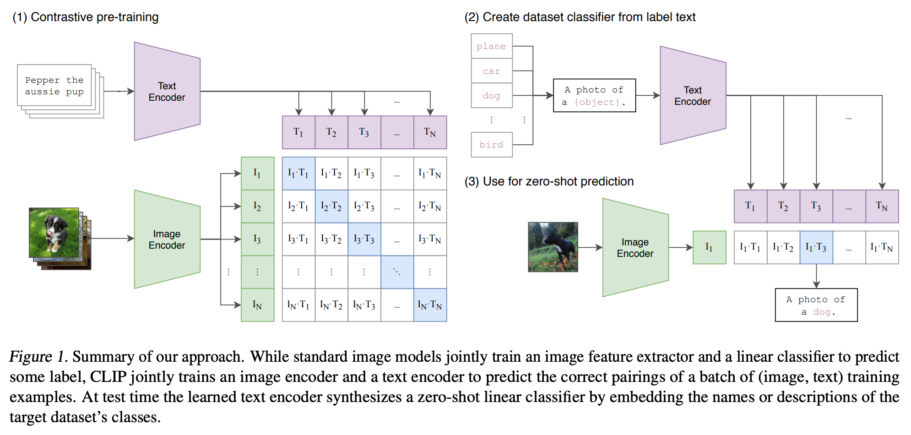
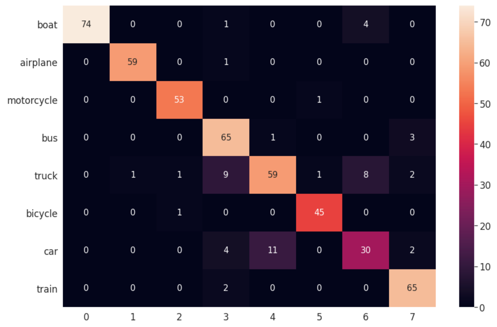

# CLIP Mania

Custom training with OpenAI CLIP; classification tasks; zero-shot examples; and a fully dockerised web-service for inference.

## CLIP in a Nutshell



[Paper](https://arxiv.org/pdf/2103.00020.pdf) | [Repository](https://github.com/openai/CLIP)

## Development Environment

After cloning this repository, please create a Conda environment as depicted below:

```shell script
conda env create -f environment.yml
```

### Running the Unit Tests

Once the Conda environment has been created and activated, you can have a tast of how the code is behaving by running
the unit tests. Execute the command below:

```shell script
pytest
```

Depending on the amount of tests added over time, the output should look something like this:

```shell script
===================================== test session starts =====================================
platform darwin -- Python 3.8.10, pytest-6.2.4, py-1.10.0, pluggy-0.13.1
rootdir: /Users/wilderrodrigues/dev/git/artificially-ai/clip-mania
collected 8 items

test/test_core/test_clip_model.py ..                                                     [ 25%]
test/test_core/test_executor.py ..                                                       [ 50%]
test/test_dataset/test_fewshot_dataset.py ..                                             [ 75%]
test/test_dataset/test_preprocess.py ..                                                  [100%]

===================================== 8 passed in 22.74s ======================================
```

## Training

To understand how the mode is trained, you can have a look at the [test executor](tests/test_core/test_executor.py), which
performs a quick test just to make sure the code is working fine. The same piece of code is used in the training
application.

Before you proceed to train with your dataset, please check below how you have to structure it.

### Preparing the Dataset

To get your custom dataset working you don't have to do much, only preparing the directory structure should be enough.

The directory structure that the system expects is depicted below:

```shell script
-> dataset
   -> train
      -> dog
      -> cat
   -> eval
      -> dog
      -> cat
   -> test
      -> dog
      -> cat
```  

### Training from the Terminal

Before you start training, please install CLIP Mania (make sure that the Conda environment has been created and is
activate):

```shell script
pip install .[dev]
```

The command above will also install the development dependencies, which includes `pytest`.

After that, the training can be started with command below:

```shell script
python -m clip_mania.application.train --dataset_path /path/to/dataset/train --model_output_path .
```

The name of the model file to be saved is defaulted to 'clip_mania_model.pt' under the given `--model_output_path`.

### Training with Docker

[wip]

## Inference

The repository provides a few ways to infer the classes of unseen images. 

### Using the provided Application

To be able to run the inference on top of your test dataset, the project requires that the dataset is structured in the
following way:

```shell script
-> dataset
   -> train
      -> dog
      -> cat
   -> eval
      -> dog
      -> cat
   -> test
      -> dog
      -> cat
```  

For inference we will be using the `test` directory, meaning that its absolute path has to be informed when running
the Inference Application.

The code below should help you to get the inference running. For now, we have no plots and no metrics being displayed.
However, we are logging the tru class, the predicted class and the probability. Soon we will have some better metrics
and plots in place.

```shell script
python -m clip_mania.application.inference --test_dataset_path /path/to/dataset/test --model_path ./clip_mania_model.pt
```

#### Results

We got the results!

From our 503 images test dataset, covering 8 classes, we achieved quite interesting results. It's important to mention
that the images are crops from the COCO dataset. We will spend some time collecting images to create small datasets
to test Few/Zero-Shot tasks against CLIP-Mania. For instance, identifying people, animals, home appliances, etc.

We will leave you to the results now.

* AUC: 0.9917
* Classification Report:
```angular2html
              precision    recall  f1-score   support

        boat       1.00      0.94      0.97        79
    airplane       0.98      0.98      0.98        60
  motorcycle       0.96      0.98      0.97        54
         bus       0.79      0.94      0.86        69
       truck       0.83      0.73      0.78        81
     bicycle       0.96      0.98      0.97        46
         car       0.71      0.64      0.67        47
       train       0.90      0.97      0.94        67

    accuracy                           0.89       503
   macro avg       0.89      0.89      0.89       503
weighted avg       0.89      0.89      0.89       503
```
* Confusion Matrix:


### Running the Web Service Locally

[wip]

### Running the Web Service with Docker

[wip]

## Zero-Shot on the Custom Model

[wip]

## Acknowledgments

I would like to thank the GitHub user [vinson2233](https://github.com/vinson2233) for the initial code snipped. Some
adjustments and bug fixes were enough to get it to work.

## Author

```angular2html
@article{Artificially Advanced Intelligence - (2A)^I,
    title={Wild, wilder, wildest: Few and Zero-Shot Learning on Custom Datasets},
    author={Wilder Rodrigues},
    year={2021}
}
```
